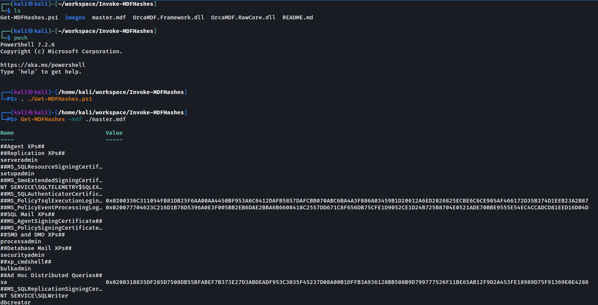

# Usage

You might find yourself in a position in which you have held administrative access to a server running a local instance of Microsoft SQL Server, but had not held credentials to access the service.

There are multiple ways to gain access to a SQL Server once you have access to the local server, some are not safe and will cause some downtime. 
To solve this issue, we can retrieve the master database file, then dump the usernames and password hash. If the password used is weak, we can attempt to crack the hash.

For MSSQL, the master database file is stored in: "C:\Program Files\Microsoft SQL Server\SQL-VERSION\MSSQL\DATA\master.mdf".
Attempts to copy the master.mdf file from a running database server will fail as SQL Server locks the file during operation. 
To safely dump hashes without interupting the operation of the server, there are a couple of ways to do this (please read the reference).

Alternatively, if you are able to read file through vulnerabilities like file inclusion, but you want to escalate it to RCE, you can try to retrieve the master.mdf and crack the sa password. 
If the MSSQL database service allows remote connection, you can login as sa and enable `xp_cmdshell` (sa user has the privilege to do so) to execute system commands.

## Steps to obtain MDF hash from the master.mdf

1. Locate the master.mdf file
2. Retrieve a copy of the file via Invoke-NinjaCopy or via vulnerabilities like file inclusion. *Note: there might be a backup copy of master.mdf at "C:\Program Files\Microsoft SQL Server\SQL-VERSION\MSSQL\Backup\master.mdf", which is not locked by the SQL Server.*
3. Extract the hash



## Cracking the hashes

- JTR hash format: mssql12
- Hashcat mode: 1731
```
hashcat -m 1731 <hash file> <wordlist>
john <hash file> -w=<wordlist> --format=mssql12
```

## Reference

(Extracting Master MDF Hashes)[https://blog.xpnsec.com/extracting-master-mdf-hashes/].
